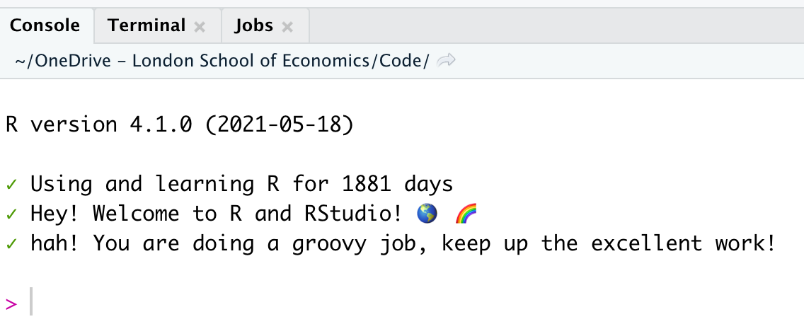

# Introduction

This is a short tutorial for fun on how to customise your R profile, which shows in the console every time you load R. You should end up with a console that looks something like this:


{width="603"}

# Part 1, install packages

Before you start you will need to install the following packages:

-   usethis

-   praise

-   lubridate	

-   purrr

-   cli

```{r eval=FALSE}
install.packages(c("usethis", "praise", 
                   "lubridate", "purrr",
                   "cli"))
```

Once they are installed you can move to part 2.

# Part 2, access your r profile

In order to change your rprofile, you will first need to get access to it. This is where the usethis package comes in, which has the very helpful function `edit_r_profile()`.

Run the code chunk below to open up your r profile.

```{r eval=FALSE}
# run to open your r profile
usethis::edit_r_profile()
```

Great, your .Rprofile should now be loaded so we can move to part 3.

# Part 3, add code to your profile

The below code chunk contains the code to make your rprofile a bit more exciting! To use it, copy and paste the code into .Rprofile. Save it, then restart R. When loaded look at your console and you'll see the new console take effect!

```{r eval=FALSE}
if(interactive()) {
  
  cat("\014") # clear screen
  cli::cli_text("")
  cli::cli_text(R.version$version.string)
  cli::cli_text("")
  
  # been using and learning r for x days
  cli::cli_alert_success(
    paste0(
      "Using and learning R for ",
      lubridate::today() - lubridate::dmy("1 may 16"),
      " days"
    )
  )
  cli::cli_alert_warning()
  # customise the prompt
  prompt::set_prompt(function(...){
    branch <- (purrr::safely(gert::git_branch))()
    if(is.null(branch$result)) return("> ")
    return(paste0("[", branch$result, "] > "))
  })
  
  # hey, welcome to r
  cli::cli_alert_success(paste("Hey! Welcome to R and RStudio!",
                               intToUtf8(127758), intToUtf8(127752)))
  cli::cli_alert_success(praise::praise("${exclamation}! You are doing a ${adjective} job, 
                                        keep up the ${adjective} work!"))
  cli::cli_text("")
  
}
```

# Part 4, edit the script to suit you

Using the script, change parts of it to suit you. You can change when you first started learning R, edit the welcome message or more! 

To help you, below are some details on what is happening in the script:

- The first section clears the console screen so you have a blank slate to work with.
- The second section adds the prompt to tell you how long you've been learning R for: it uses a combination of paste0 and lubridate. To change this to when you started learning R, change the date from 1 may 16 to whenever your first R experience was. You can add other achievements (or failures using `cli::cli_alert_warning()`) here too, like when you graduated or learned to drive.
- The third section tells you what git branch you are in. This is very helpful if you are using git with R. If you are not using git you will just get the default console setting.
- The final section uses paste and praise to add welcome messages. If you want to find out more about the praise package, check out it's [github repo](https://github.com/rladies/praise).

That's it! Enjoy editing and making a welcoming rprofile.
